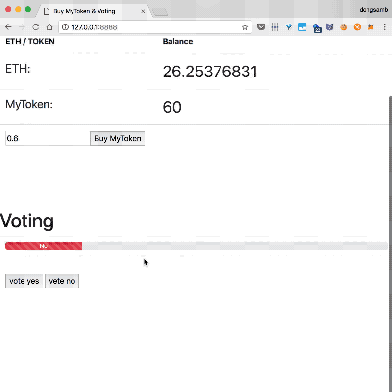

# Voting DApp

## Requirements

- Truffle v4.1.5 
- Solidity ^0.4.21
- Web3.js 0.20.6
- npm or python ( for local server )


## Run this example

common

```bash
git clone https://github.com/solidity-korea/dapp-voting.git
cd dapp
```

#### using npm (browserfy, http-server)
```bash
npm install
npm start
```

Now open your browser at `http://localhost:8888`


#### using python http.server(SimpleHTTPServer)
```bash
git checkout python

python3 -m http.server      // python3  
python -m http.server       // python(3)
python -m SimpleHTTPServer  // python2

```
Now open your browser at `http://localhost:8000`




## Check Contract Transactions

- Ropsten
    - contract address: [0x7a3f323595ecdf28788f78e3cffa779776419e95](https://ropsten.etherscan.io/address/0x7a3f323595ecdf28788f78e3cffa779776419e95)